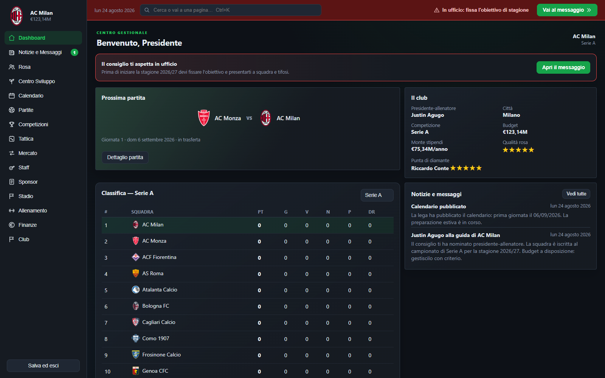
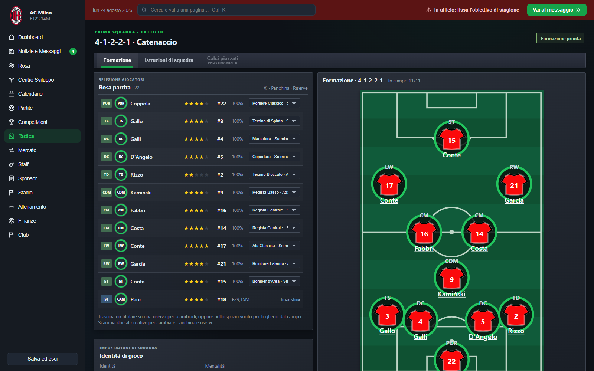
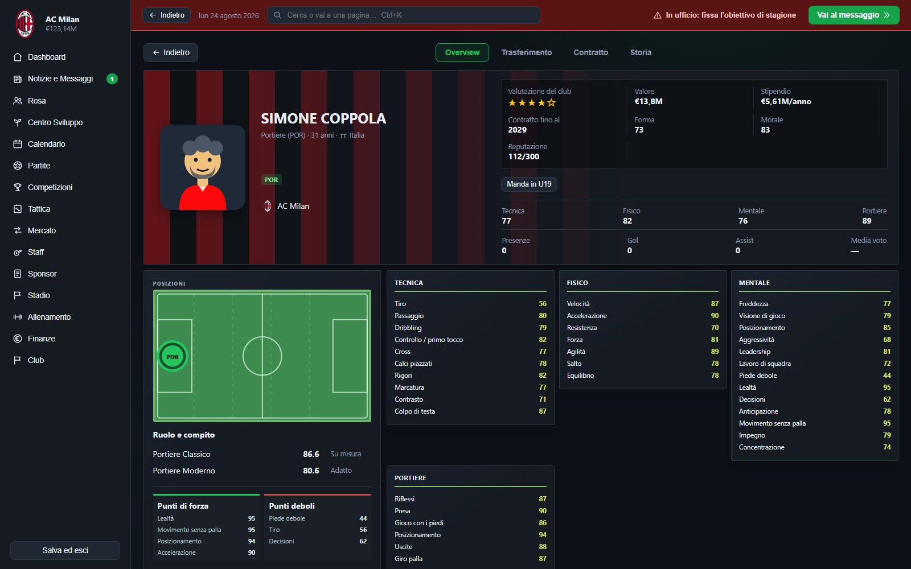
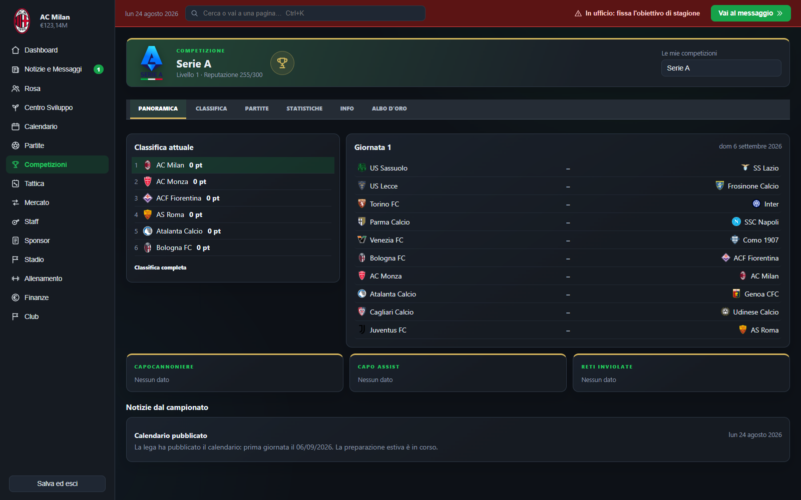

# President Manager

President Manager is a data-driven football management simulation in which the player acts as both club president and head coach. The project combines squad management, tactical decision-making, transfers, finance, youth development, multi-season progression, and a statistically calibrated match engine.

The current React application is a functional prototype used to validate the game's systems, data model, simulation logic, and user experience. A future production version may be rebuilt in Godot or Unity once the core design is stable.

## Current status

The prototype supports playable careers across Serie A and Serie B, with promotion and relegation, national cups, persistent player histories, club finances, and season rollover. Its world database is externalised into validated JSON files so that clubs, players, countries, competitions, and league structures can be expanded without rewriting the game logic.

The project is under active development. Core management systems are playable, while international competitions, loans, advanced staff contracts, long-term economic balancing, and the final 2D presentation remain in development.

## Screenshots

### Club dashboard



### Tactical setup



### Player overview



### Competition overview



## Key features

### Persistent football world

- Multi-season careers with new calendars and archived seasonal statistics
- Configurable promotion and relegation between divisions
- Player ageing, development, decline, contract expiry, retirement, and youth generation
- Historical competition records, awards, winners, and individual statistics
- A global country catalogue with primary and secondary player nationalities
- Save migration support for older career formats

### Ventidue match engine

Ventidue is the project's deterministic football simulation engine. It models possession, tactical decisions, player roles, attribute-based duels, pressing, fatigue, morale, injuries, discipline, substitutions, and tactical familiarity.

The engine uses individual technical, physical, mental, and goalkeeping attributes rather than relying directly on a single overall rating. Match output is tested through repeatable simulations and golden-seed regression checks.

The current multi-division calibration sample covers 5,256 matches across Serie A, Serie B, Serie C, a synthetic Serie D tier, and Eccellenza. Depending on the division, the sample produces approximately:

- 2.07-2.46 goals per match
- 10.7-13.0 shots per team
- 73.8%-83.4% pass completion
- 22%-26% of goals after the 75th minute

The full technical design is documented in [`docs/motore/`](docs/motore/README.md).

### Tactics and squad selection

- Drag-and-drop tactical board with position-specific slots
- Player suitability and role familiarity shown through visual indicators
- Team instructions including pressing and defensive line settings
- Automatic formation selection for user and CPU-controlled clubs
- Shirt-number registration and squad selection rules
- Match-day substitutions for both the user and CPU

### Transfers and contracts

- Summer and winter transfer windows
- Search, pagination, nationality, position, role, budget, and free-agent filters
- User and CPU transfer activity based on squad needs
- Offers, counteroffers, rejections, transfer listing, and interested clubs
- Contract renewals and free-agent signings
- A 180-day restriction after a signing or renewal to prevent immediate resale or repeated renegotiation
- Transfer history stored in player career records

### Club management

- Sponsorship offers and multi-year agreements
- Stadium capacity, attendance, ownership, ticketing, and commercial facilities
- Income and expense tracking with financial charts and transaction history
- Staff roles with gameplay effects: scout, medical team, fitness coach, and assistant manager
- Dressing-room hierarchy, morale, promises, and player dissatisfaction
- Seasonal objectives and mandatory management decisions delivered through the inbox

### Youth development

- Under-13, Under-17, and Under-19 squads
- Club-relative star ratings for youth players
- Training, progression, promotion, and temporary first-team integration
- Youth trials and generated academy intakes
- Conditional Under-23 reserve-team creation for eligible top-division clubs

### Competitions and media

- Independent competition pages with standings, fixtures, statistics, information, and history
- Detailed top-30 player rankings for goals, assists, clean sheets, and other metrics
- National knockout cups with configurable entry rounds, byes, two-legged ties, and penalties
- Club messages, match reports, transfer news, and seasonal awards
- Persistent global search for players, clubs, staff, competitions, awards, countries, and game sections

## Data architecture

The game world is stored as modular JSON rather than being embedded in the interface. The main content files are located in [`src/game/database/`](src/game/database/) and cover:

- countries and national identities
- competitions and league levels
- promotion and relegation links
- clubs and stadium information
- manually defined players
- database metadata and schema versioning

Each club can define its own playing strength independently from its reputation. Missing players and squad depth can be generated procedurally, allowing manually researched data and generated content to coexist.

The database validator checks identifiers, references, ranges, competition membership, and structural consistency:

```bash
npm run database:validate
```

The editing format and examples are documented in [`docs/database-editor-guide.md`](docs/database-editor-guide.md).

## Technology

- **Frontend:** React 18, JavaScript, HTML, CSS
- **Build tooling:** Vite
- **Data:** versioned JSON database
- **Persistence:** browser `localStorage` with save migrations
- **Testing:** deterministic simulation harnesses, smoke tests, and golden-seed regression tests
- **Visuals:** SVG-based tactical and match displays

The simulation and game rules are kept in [`src/game/`](src/game/) without React dependencies. Interface components are contained in [`src/ui/`](src/ui/), allowing the underlying systems to be tested independently from the presentation layer.

## Getting started

### Requirements

- Node.js 18 or later
- npm

### Installation

```bash
git clone <repository-url>
cd PRESIDENTMANAGER
npm install
npm run dev
```

Vite will print the local development address, normally `http://localhost:5173`.

### Production build

```bash
npm run build
npm run preview
```

## Validation and testing

The repository contains focused checks for the database, match engine, career progression, finances, transfers, contracts, competitions, and replay data.

```bash
npm run database:validate
npm run motore:golden
npm run harness:multidivisione -- 3
npm run career:smoke
npm run contracts:smoke
npm run economy:smoke
npm run serie-b:smoke
npm run cups:smoke
npm run replay:smoke
npm run build
```

`motore:golden` verifies that reference matches remain deterministic. The multidivision harness measures statistical output at different levels of the football pyramid without requiring every division to be active in a career.

## Project structure

```text
src/
  game/                 Simulation, career rules, economy, transfers, and data
    database/           Countries, competitions, links, clubs, and players
    motore/             Ventidue match engine
  ui/                   React screens and reusable interface components
  assets/               Interface, club, and competition assets
tools/
  harness/              Statistical simulations and regression baselines
  *.mjs                 Database and gameplay smoke tests
docs/
  GDD.md                Consolidated game design document
  blueprint.md          Product and development blueprint
  database-editor-guide.md
  economia-serie-a.md
  motore/               Match-engine architecture and calibration documents
```

## Development roadmap

The recommended next stages are:

1. finalise national and international reputation models for clubs and players;
2. add staff contracts, contract duration, and dismissal clauses;
3. implement loans, time-based negotiations, and a complete transfer-history section;
4. calibrate Serie B, Serie C, and lower-division economies;
5. test economic and sporting stability over long careers;
6. expand dressing-room relationships, training, supporters, and narrative events;
7. add lightweight simulation for distant leagues and continental competitions;
8. build a standalone visual database editor;
9. complete the final synchronisation and visual refinement of the 2D match view.

The broader design and backlog are maintained in [`docs/GDD.md`](docs/GDD.md) and [`docs/blueprint.md`](docs/blueprint.md).

## Known limitations

- The 2D match view is an event-driven visualisation and still requires final animation and commentary synchronisation work.
- Serie A has the most detailed economic calibration; lower divisions currently use more provisional values.
- National knockout cups are playable, while continental competitions and group stages are not yet simulated.
- Staff members do not yet have complete contract duration and dismissal-clause systems.
- The external JSON structure is editable, but a standalone visual editor has not yet been built.
- The current interface and local save format belong to the prototype and may change before a production release.
